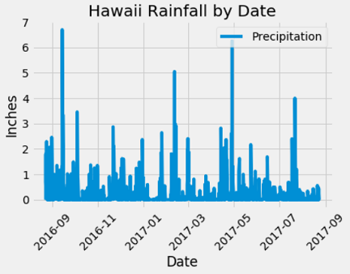

# Hawaii Vacation Analysis
## SQLAlchemy and Flask

This project uses SQLAlchemy to query historical weather data to plan a Hawaiian vacation and uses Flask to set up an API call to retrieve relevant weather data.

# PART I - SQLAlchemy

This section of the project is saved in the Jupyter Notebook file: **sqlalqemy_hawaai**

Uses: Python, Pandas, Matplotlib, and SQLAlchemy

### Queries include:  
 * Retrieve the most recent 12 months of precipitation data from the database, load into a Panda dataframe.  
 
    - Matplotlib was used to plot the results.
    - Pandas was used to print the summary statistics

 

 
 * Determine the most active weather stations recording climate data in Hawaii.

    - Lists all the weather stations and the total number of observations made by each weather station.

 * Using the most active weather station (the station with the highest count of observations), retrieve the temperature data (tobs) for the most recent 12 months in the database.
     - Matplotlib was used to plot the results in a histogram:  this histogram shows the most frequent temperatures that were recorded.
    
 

  * Queries to help with vacation planning:

    - Compare June temperatures to December temperatures.
    - Use unpaired T-Test to determine if the difference in mean temperatures in June and December are statistically significant.
    - Use planned vacation dates to pull temperature data from the same days from previous years.
    - Retrieve rainfall data from each weather station for the planned vacation days.
    - Calculate the Min, Max, and Avg temperatures for the planned vacation days and plot the anticipated temperatures for the vacation.
    

# PART II - Flask
This section of the project is saved in the Python file: **app**

Uses:  Python, Flask

This app is uses Flask to create an API to query the same Hawaii weather database and return a JSON of the results.

<h2>Available Routes:</h2>
        <strong>/api/v1.0/precipitation</strong> 
        - - - - - Returns the most recent 12 months of precipitation data (2016-08-23 thru 2017-08-23) 
         
        <strong>/api/v1.0/stations</strong> 
        - - - - - Returns all stations and observation count for each station 
        
        <strong>/api/v1.0/tobs</strong> 
        - - - - - Returns the Min, Max, and Avg temperature recorded in the most recent 12 months by the most active station 
         
        <strong>/api/v1.0/yyyy-mm-dd</strong> 
        - - - - - Returns the Min, Max, and Avg temperature recorded between the starting date <strong>yyyy-mm-dd</strong> and 2017-08-23 
         
        <strong>/api/v1.0/yyyy-mm-dd/yyyy-mm-dd</strong> 
        - - - - - Returns the Min, Max, and Avg temperature recorded between the starting date <strong>yyyy-mm-dd</strong> and end date <strong>yyyy-mm-dd</strong> 
        - - - - - Date range for available data:  2010-01-01 thru 2017-08-23

